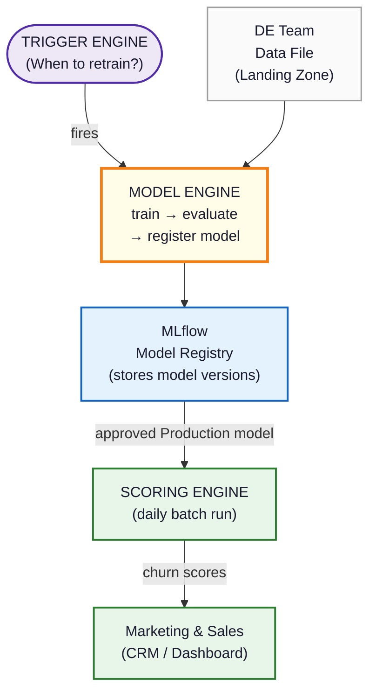

# Churn Prediction Pipeline - Model Engine

A ML model training pipeline for predicting B2B/SaaS customer churn. It ingests customer trajectory data, trains tree-based models (Random Forest / XGBoost), evaluates them, and registers the best model to MLflow's Model Registry. It supports both binary (churn vs. non-churn) and multiclass (churn / renewal / expansion / downsell) prediction.

## Business Context

Customer churn is one of the highest-cost problems in subscription and B2B businesses.
This project provides the **Model Engine** of a production-grade churn prediction system —
the component responsible for building, validating, and publishing the machine learning
models that power retention decisions across Marketing and Sales.

### The system is designed to support four business use cases:

**1. Consume DE team CRM data**
Ingests aggregated customer feature snapshots prepared by the Data Engineering team,
applying schema validation and preprocessing before model training.

**2. Scheduled and event-driven retraining**
The pipeline is invocable via a single CLI command and designed to be called by an
external Trigger Engine — whether on a time schedule or in response to data drift —
keeping models current without manual intervention.

**3. Daily churn risk scoring**
The trained model is registered into the MLflow Model Registry. An approved Production
version is consumed by a Scoring Engine that runs daily batch inference and produces
per-customer churn probability scores.

**4. Marketing and Sales actioning**
Scores flow downstream to CRM tools and dashboards, enabling targeted retention
campaigns driven by model-predicted churn risk.

### Where this repository fits

This repository implements the **Model Engine box only**. The Trigger Engine,
Scoring Engine, and CRM/Dashboard are separate components that integrate via
the MLflow Model Registry and the `run_churn_pipeline.py` CLI entry point.



---

## Main Pipeline Steps

1. **Load and Prepare Data**
   - Set up the target variable for binary/multiclass classification
   - Drop irrelevant features

2. **Data Splitting**
   - Split data into Train (70%), Validation (15%), and Test (15%)
   - Use GroupShuffleSplit to ensure all snapshots of a customer stay in the same set

3. **Model Tuning and Selection**
   - Use PredefinedSplit for GridSearchCV hyperparameter tuning
   - Model selection based on validation performance

4. **Evaluation on Test Set**
   - Generate Confusion Matrix, Classification Metrics, ROC Curve
   - Feature Importance Analysis to identify key drivers of churn

---

## Pipeline Orchestrator Flow

```
┌─────────────────────────────────────────────────────────────────────────┐
│  config.py                                                              │
│  cfg.MODEL = "random_forest" (default) | 'xgboost'                      │
│  cfg.MODE = BINARY (default) | MULTICLASS                               │
│  PRE_PROCESSING_FLAG = True | False (default)                        │
└───────────────────────────┬──────────────────────────────────────────────┘
                            │
┌───────────────────────────▼──────────────────────────────────────────────┐
│  PREPROCESSING STEP                                                      │
│  if (PRE_PROCESSING_FLAG OR NOT INPUT_PATH.exists()):                    │
│      run: load → validate → create_target → impute → save                │
└───────────────────────────┬──────────────────────────────────────────────┘
                            │
┌───────────────────────────▼──────────────────────────────────────────────┐
│  MODEL PIPELINE (Binary or Multiclass)                                   │
└───────────────────────────┬──────────────────────────────────────────────┘
                            │
             ┌──────────────▼───────────────┐
             │  load_data()                  │
             │  split_data()                 │
             │  verify_split()               │
             │  build_pipeline()             │
             │  build_search_set()           │
             │                               │
             │  ┌─── MLflow Run ──────────┐  │
             │  │  enable_autolog()       │  │
             │  │  log_run_config()       │  │
             │  │  run_grid_search()      │  │
             │  │  tag_child_runs()       │  │
             │  │  evaluate()             │  │
             │  │  log_evaluation()       │  │
             │  │  get_feature_imp()      │  │
             │  │  log_feature_imp()      │  │
             │  │  save_model()           │  │
             │  │  log_sklearn_model()    │  │
             │  │  register_model()       │  │
             │  └─────────────────────────┘  │
             └──────────────────────────────┘
```

---

## Assumptions

- The data is clean
- No missing values (or handled by preprocessing)
- EDA and feature engineering have been completed
- All snapshots of a customer are consistent in the dataset

---

## Why Random Forest (Tree-Based Ensemble)?

### Advantages of Tree-Based Ensemble Models

- **Implicit Feature Selection**: Internally handle feature selection without explicit feature engineering
- **Robustness**: Robust to outliers and noise
- **No Feature Scaling Required**

### Random Forest vs. XGBoost

| Aspect | Random Forest | XGBoost |
|--------|---------------|---------|
| **Training Strategy** | Bagging (parallel) | Boosting (sequential) |
| **Robustness** | More robust overall | Less robust without tuning |
| **Overfitting Risk** | Lower risk - averages uncorrelated trees | Higher risk with weak regularization |
| **Hyperparameter Sensitivity** | Lower  | Higher - requires careful tuning |
| **Outlier Handling** | Very robust | Can amplify outliers via residuals |

**Random Forest is chosen as baseline** because it requires less hyperparameter tuning, is more robust to overfitting, and provides stable performance across diverse datasets.

---

## How to Use It

### Step 1: Configure Settings
Open `src/config.py` and set:
```python
MODE = ClassificationType.BINARY        # or MULTICLASS
MODEL = "random_forest"                  # or "xgboost"
```

### Step 2: Run the Pipeline

**Production — CLI script (`run_churn_pipeline.py`):**
```bash
# Binary classification
python run_churn_pipeline.py --classification_type binary

# Multiclass classification
python run_churn_pipeline.py --classification_type multiclass
```

**CLI Arguments:**

| Argument | Required | Values | Description |
|----------|----------|--------|-------------|
| `--classification_type` | Yes | `binary` \| `multiclass` \| `multi` | Classification mode to run. `multi` is an alias for `multiclass` |

> `MODEL` is hard-fixed to `random_forest` in the CLI script.

**Exit codes:**

| Code | Meaning |
|------|---------|
| `0` | Pipeline completed successfully |
| `1` | Pipeline failed — exception logged to MLflow run and `.log` file |
| `2` | Bad CLI argument (argparse default) |

The pipeline automatically:
- Preprocesses raw data (if needed)
- Loads and splits data correctly
- Builds preprocessing pipeline
- Tunes hyperparameters with MLflow autologging
- Evaluates on test set and logs metrics
- Saves and registers the final model in MLflow Model Registry

> **Notebooks are used for development and testing only. Use `run_churn_pipeline.py` for all production runs.**

### Step 3: Access Results
- **Metrics**: Classification accuracy, precision, recall, F1-score, ROC-AUC
- **Feature Importance**: Top 20 features driving churn predictions
- **Saved Model**: Pipeline saved in `model/` directory and registered in MLflow Model Registry

### Step 4: Use MLflow to Track and Compare Experiments

**Launch the MLflow UI:**
```bash
python -m mlflow ui
```
Then open a browser and go to `http://localhost:5000`.

**What you can do in the MLflow UI:**
- **Compare runs**: View all experiment runs side-by-side and compare hyperparameters and metrics across binary and multiclass models
- **Analyse metrics**: Inspect logged test-set metrics (accuracy, F1, ROC-AUC) for each run
- **View artifacts**: Inspect feature importance plots and model files logged per run
- **Model Registry**: View registered models, link runs to registry entries for traceability
- **Reproduce results**: All run parameters and environment details are logged automatically for reproducibility

**MLflow Tracking — what is logged per run:**

| What | How |
|------|-----|
| Hyperparameters | `enable_autolog()` — automatic via sklearn autologging |
| GridSearch child runs | `tag_gridsearch_child_runs()` — named `hyperparameterSet-{ID}` |
| Config (MODE, MODEL) | `log_run_config()` |
| Test-set metrics + plots | `log_evaluation()` |
| Feature importance table + plot | `log_feature_importance()` |
| Model (sklearn pipeline) | `log_sklearn_model()` — includes env files and model signature |
| Model Registry entry | `register_model()` — links run for full traceability |
| Pipeline log file | `upload_pipeline_log_file()` — uploads `.log` file as MLflow artifact |

---
## Logging

The pipeline writes a **log file** during every run — a plain-text record of what happened, when. This makes every run **audit-ready**.

**Log file location:** `logs/pipeline_<ClassificationType>_<MODEL>_YYYYMMDD_HHMMSS.log`

**Two types of log messages:**

| Type | Meaning | Example |
|------|---------|---------|
| `INFO` | Information | `[data_loader] Loading data from: data\raw_churndata.csv` |
| `ERROR` | Error - requires attention | `FileNotFoundError - Input file not found` |

> The log file is also uploaded to MLflow as an artifact, so each experiment run has a permanent, traceable record.


## Project Structure

```
00_Aditya_ChrunPrediction/
├── src/
│   ├── config.py                # Configuration: MODE, MODEL, paths, MLflow settings
│   ├── data_loader.py           # Load preprocessed data
│   ├── preprocessor.py          # Raw data cleaning & preprocessing
│   ├── splitter.py              # Train/Val/Test splitting
│   ├── pipeline_builder.py      # Build preprocessing + model pipeline
│   ├── tuner.py                 # GridSearchCV hyperparameter tuning
│   ├── evaluation.py            # Model evaluation metrics
│   ├── feature_importance.py    # Extract feature importance
│   ├── model_saver.py           # Save trained models
│   ├── model_registry.py        # Model configuration registry
│   ├── mlflow_logger.py         # MLflow tracking: init, logging, model registry
│   ├── pipeline_logger.py       # Python logging: pipeline run log file
│  
├── data/                         
│   ├── trajectory_events.csv    # Event-level data
│   └── trajectory_snapshots.csv # Snapshot-level data
├── logs/                         # Pipeline run log files (auto-generated)
├── mlruns/                       # MLflow experiment runs (auto-generated)
├── model/                        # Saved trained models (joblib)
├── run_churn_pipeline.py        # CLI entry point — production pipeline script
│
├── notebooks/  (development & testing only — not used in production)
│   ├── churn_model_pipeline_mlflow_pyLog.ipynb  # Orchestrator notebook (MLflow + Logging)
│   ├── churn_model_pipeline_mlflow.ipynb        # Orchestrator notebook (MLflow, no logging)
│   ├── churn_model_pipeline.ipynb               # Orchestrator notebook (no MLflow)
│   ├── 01_churn_model_tuning_selection.ipynb    # Binary model tuning & selection
│   └── 01_churn_model_tuning_selection_MClass.ipynb  # Multiclass model tuning & selection
│
├── requirements.txt             # Python dependencies
└── README.md                    # This file
```

---

## Python & Library Dependencies

**Python Version**: 3.13+

### Installation

```bash
pip install -r requirements.txt
```

---

## MLflow Integration

**MLflow** is integrated into the pipeline for experiment tracking, model versioning, and model registry management.

### Key capabilities provided by `src/mlflow_logger.py`

- **`init_mlflow()`** — Sets the tracking URI and experiment. Creates or restores the experiment if needed.
- **`make_run_name()`** — Generates a versioned, dated run name: `{model}_{mode}_v{N}_{YYYYMMDD}`
- **`start_run()`** — Context manager that wraps steps 5–8 in a named MLflow run
- **`enable_autolog()`** — Enables sklearn autologging (hyperparameters, CV results logged automatically)
- **`log_run_config()`** — Logs pipeline configuration (MODE, MODEL, scoring)
- **`tag_gridsearch_child_runs()`** — Renames GridSearchCV autolog child runs to `hyperparameterSet-{ID}` for readability in the UI
- **`log_evaluation()`** — Logs test-set metrics and evaluation plots as MLflow artifacts
- **`log_feature_importance()`** — Logs feature importance table (CSV) and plot as MLflow artifacts
- **`log_sklearn_model()`** — Logs the best estimator as a proper MLflow sklearn model, including environment files and inferred model signature
- **`register_model()`** — Registers the logged model in the MLflow Model Registry and tags it with mode and model type for traceability
- **`upload_pipeline_log()`** — Uploads the pipeline `.log` file as an MLflow artifact for full run traceability

---


