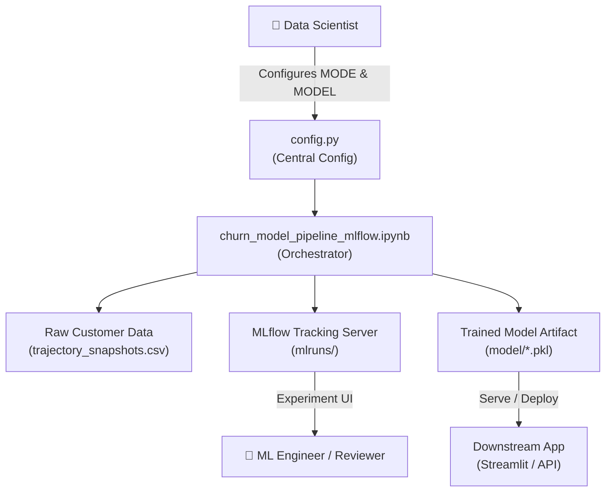
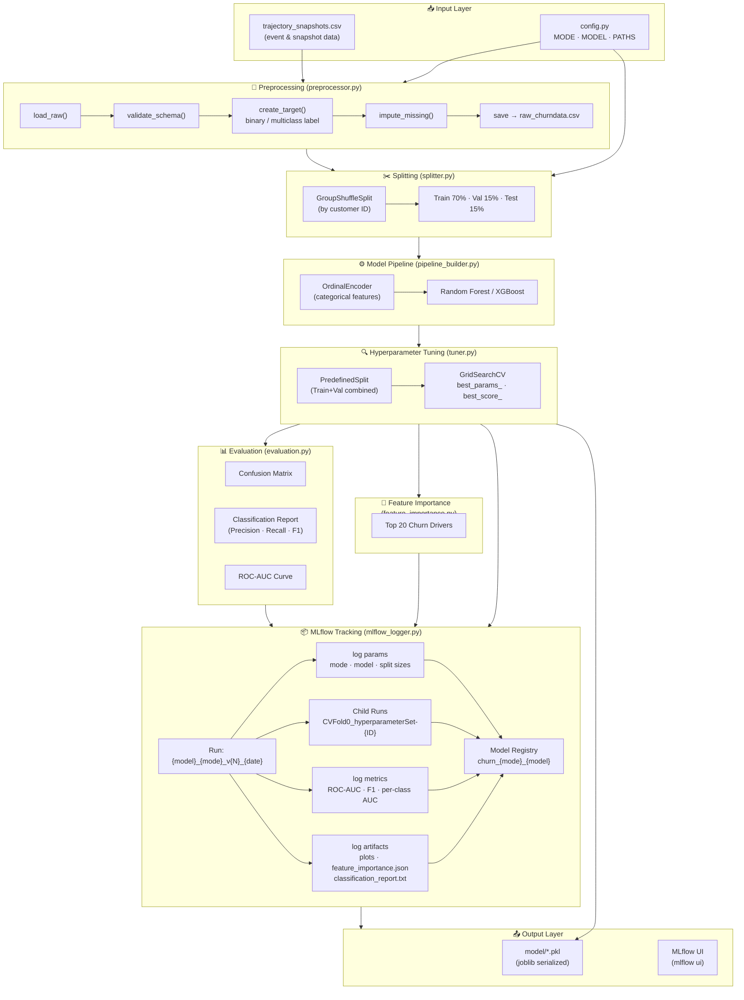
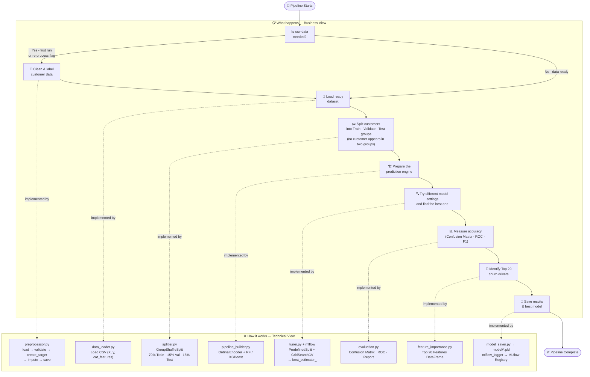

# Churn Prediction Pipeline — MLflow Project Summary

---

## 1. Problem Statement

Customer attrition (**churn**) directly impacts a business's revenue and retention metrics. Key challenges include:

- Customer journeys are captured across **multiple time-based snapshots**, making it hard to establish clean train/test splits without data leakage.
- The business needs to predict churn in **two modes**: binary (Churn vs. Non-Churn) and multiclass (e.g., Churn, Renewal, Expansion, Downsell).
- Traditional one-off scripts result in **non-reproducible experiments** — it's hard to compare model runs, hyperparameter sets, or track what produced the best model.
- Identifying the **top drivers of churn** for downstream customer success intervention is as important as prediction accuracy itself.

---

## 2. Solution

An automated, modular, and MLflow-tracked end-to-end churn prediction pipeline that:

- Preprocesses trajectory snapshot data into a clean, model-ready format.
- Splits data **leak-free** by grouping all snapshots of a single customer together.
- Trains and tunes **Random Forest** (default) or **XGBoost** via `GridSearchCV`.
- Evaluates and exports Confusion Matrix, ROC Curve, Classification Report, and Top-20 Feature Importances.
- Tracks **every experiment run, hyperparameter child run, and final model artifact in MLflow**, enabling full reproducibility and version-controlled model promotion.

---

## 3. System Design

### 3a. System Context Diagram



---

### 3b. Data Flow Diagram



---

### 3c. Pipeline Orchestrator Activity Diagram



---

## 4. Technical Stack

| Category | Technology | Version |
|---|---|---|
| **Language** | Python | 3.13+ |
| **Core Data** | pandas, numpy, scipy | ≥1.3, ≥1.20, ≥1.7 |
| **Machine Learning** | scikit-learn | ≥1.7.2 |
| **Gradient Boosting** | XGBoost | ≥2.0.0 |
| **Experiment Tracking** | MLflow | ≥2.12.0 |
| **Model Serialization** | joblib, pickle-mixin | ≥1.5.2, ≥1.0.2 |
| **Visualization** | matplotlib, seaborn | ≥3.4, ≥0.11 |
| **Deployment / App** | Streamlit | ≥1.10.0 |
| **Notebook Interface** | Jupyter, ipykernel | ≥1.0, ≥6.0 |
| **Stats Modeling** | statsmodels | ≥0.13.0 |

---

## 5. Assumptions

> These are preconditions that are taken as true for the pipeline to run correctly.

- **Pre-cleaned Data**: The raw `trajectory_snapshots.csv` has already passed EDA and basic feature engineering before entering the pipeline.
- **No residual missing values**: After preprocessing, no `NaN` values remain in the feature set that would cause model failures.
- **Snapshot consistency**: All temporal snapshots belonging to a single customer share the same `deal_id` / `company_id`, making `GroupShuffleSplit` effective.
- **Labels are correct**: Target labels (`churn`, `renewal`, etc.) have been correctly assigned during preprocessing — the pipeline does not validate business-label logic.
- **Static feature engineering**: Features are assumed to be pre-engineered; the pipeline does not create new domain features automatically.
- **Single active experiment**: MLflow is treated as a local experiment tracker (`mlruns/` folder). Remote server setup is not assumed.

---

## 6. Constraints

> These are inherent limitations of the current design that bound what the system can or cannot do.

- **Binary & Multiclass only**: The pipeline supports only classification tasks — regression-based churn scoring (probability ranking without a threshold) is not directly supported.
- **GridSearchCV — Exhaustive Search Only**: The hyperparameter tuner tests **every single combination** in the defined grid, one by one. This means as the search space grows, training time grows proportionally. There is no smarter strategy (e.g. Bayesian search) to skip combinations that are unlikely to improve the score. *Example: if you define 3 hyperparameters with 4 values each, GridSearchCV will train and evaluate 4 × 4 × 4 = **64 models** in full — none are skipped. For large grids this becomes computationally expensive and slow.*
- **Local MLflow tracking only**: MLflow tracking URI points to the local `mlruns/` folder. There is no remote model registry or artifact store configured.
- **No real-time inference**: The pipeline is batch-oriented. Online/streaming inference for real-time customer events is not supported.
- **Python 3.13+ required**: The codebase has not been tested on older Python versions; backward compatibility is not guaranteed.
- **Autolog child run cap (5 runs visible)**: MLflow's [enable_autolog()](file:///c:/Users/ashu/Documents/001-Python/00_Aditya_ChrunPrediction/src/mlflow_logger.py#116-132) is configured to capture at most **5 child runs** per GridSearch execution — even if GridSearch evaluates 50 or 100 parameter combinations. Only the top 5 parameter sets appear as individual child runs in the MLflow UI. *Example: GridSearchCV tests 48 hyperparameter combinations. MLflow records all 48 in `cv_results_`, but only 5 appear as named child runs (`CVFold0_hyperparameterSet-000` through `-004`) in the Experiments view. The remaining 43 are not individually visible in the UI — though the best result is still captured in the parent run.*

---

> [!NOTE]
> **Design Decision — Model Choice (Random Forest & XGBoost)**
> The pipeline intentionally limits model selection to Random Forest and XGBoost. This is a deliberate engineering choice, not a gap. These tree-based ensemble models were selected because they require no feature scaling, handle mixed data types natively, are robust to outliers, and provide built-in feature importance. See `README.md → Why Random Forest?` for the full comparison.

---

## 7. Use Cases

| Use Case | Description |
|---|---|
| **Binary Churn Detection** | Predict whether a customer will churn (Yes/No) and flag high-risk accounts for proactive outreach |
| **Multiclass Outcome Scoring** | Classify customers into Churn / Renewal / Expansion / Downsell to prioritize the right intervention per segment |
| **Driver Analysis** | Surface the Top 20 financial and engagement features driving churn so Customer Success can take targeted actions |
| **Experiment Tracking** | Compare multiple model runs (RF vs XGBoost, Binary vs Multiclass) using the MLflow UI to select the champion model |
| **Model Registry & Versioning** | Register versioned models (`churn_binary_random_forest_v3`) in MLflow for traceable, auditable deployment decisions |
| **Deployment-Ready Export** | Serve the best estimator directly via `mlflow models serve` or load via `mlflow.pyfunc.load_model()` for batch scoring |

---

## 8. How to Use

### Step 1 — Install Dependencies
```bash
pip install -r requirements.txt
```

### Step 2 — Configure the Pipeline
Edit [src/config.py](file:///c:/Users/ashu/Documents/001-Python/00_Aditya_ChrunPrediction/src/config.py):
```python
MODE  = ClassificationType.BINARY       # or MULTICLASS
MODEL = "random_forest"                 # or "xgboost"
PRE_PROCESSING_FLAG = False             # Set True to force re-preprocessing
```

### Step 3 — Run the Orchestrator Notebook
Open [churn_model_pipeline_mlflow.ipynb](file:///c:/Users/ashu/Documents/001-Python/00_Aditya_ChrunPrediction/churn_model_pipeline_mlflow.ipynb) and **Run All Cells**. This will:
1. Preprocess raw data (if flagged)
2. Load, split and verify data
3. Build the preprocessing + model pipeline
4. Tune hyperparameters via `GridSearchCV`
5. Evaluate on the held-out test set
6. Log everything to MLflow (params, metrics, plots, model)
7. Register the best model in the MLflow Model Registry

### Step 4 — Monitor Experiments in MLflow UI
```bash
mlflow ui
```
Open [http://127.0.0.1:5000](http://127.0.0.1:5000) to:
- Compare run metrics across hyperparameter sets
- View feature importance charts and ROC curves
- Inspect registered model versions

### Step 5 — Access Outputs

| Output | Location |
|---|---|
| Trained model (`.pkl`) | [model/](file:///c:/Users/ashu/Documents/001-Python/00_Aditya_ChrunPrediction/src/mlflow_logger.py#299-371) directory |
| MLflow run artifacts | `mlruns/` directory |
| Classification report | MLflow → Artifacts tab → `classification_report.txt` |
| Feature importance chart | MLflow → Artifacts tab → `feature_importance.png` |

### Step 6 — Serve the Model (Optional)
```bash
mlflow models serve -m "runs:/<run_id>/sklearn_model" --port 1234
```
Or load programmatically:
```python
import mlflow.pyfunc
model = mlflow.pyfunc.load_model("runs:/<run_id>/sklearn_model")
predictions = model.predict(X_new)
```
